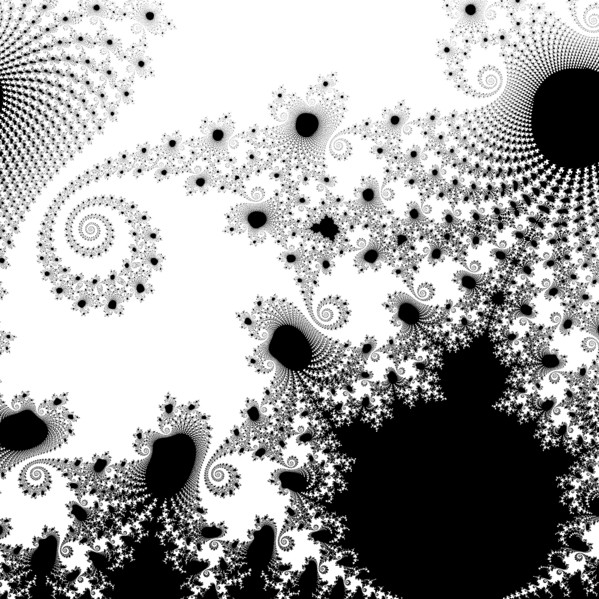

# fracpgm3

Code for generating images from of the Madelbrot set.

## Usage
 
usage: fracpgm3 \[options\] > image.ppm

where \[options\] are:
-width n    where n (int) is the width of the image in pixels 
-aspect n   where n (float) is the aspect ratio of the image (width/height) 
-xpos n     where n (float) is the x coordinate in the fractal of the middle pixel in the image 
-ypos n     where n (float) is the x coordinate in the fractal of the middle pixel in the image 
-over n     where n (int) is the number of times to oversample each pixel (in each axis) 
-iter n     where n (int) is the maximum number of itterations to use for each pixel 

## Example

A slow, but nice example, is as follow:

fracpgm3  -width 1000 -aspect 1. -xpos -1.48165  -ypos 0.001 -zoom 60000 -iter 1000 -over 7 > image.ppm

Hint -- to get started try:

fracpgm3 -xpos -0.5 -ypos 0.0 -zoom 1 | display -

And slowly change xpos, ypos and zoom until you find a point you want to image, then ramp up the width, iterations and oversampling. 

## Sample image:

## Install

I have only ever tried installing on Linux. As long as you have the standard development tools installed (specifically `gcc` and `make`) it should just be a case of typing `make`.

